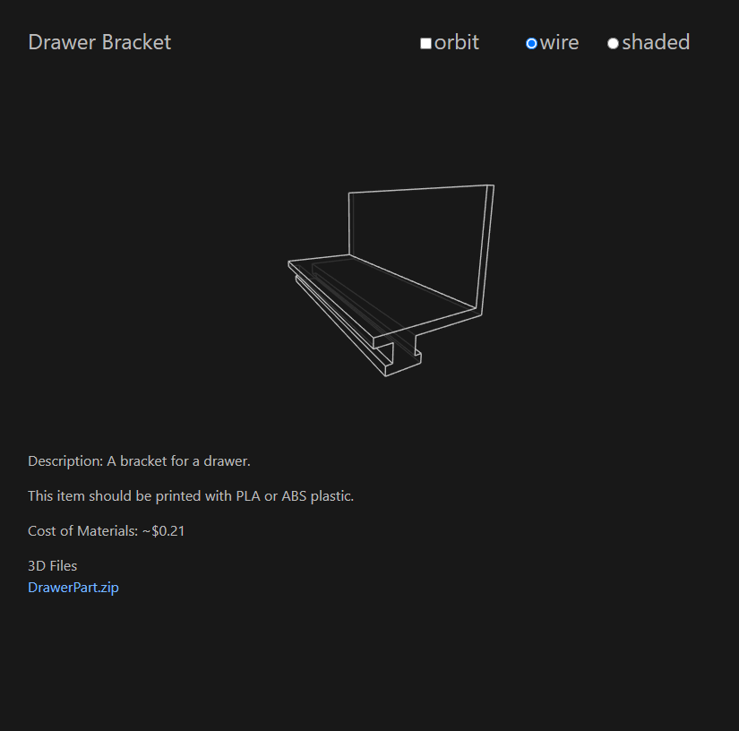

# 3D Jekyll Page Template #

This repository contains a layout that can be used to create a page that displays a 3D printable object using the static site generator `jekyll`. An example can be seen [here](https://www.srich.us/threed/drawer_part/). The page contains a canvas where a visual 3D display of the object is provided using the [`three.js`](https://github.com/mrdoob/three.js/) library. The page also contains some basic information about what the object is, the cost of the filament to print the object, and it provides links to the files for download. It is created so that no `html` needs to be changed and only the `yaml` Front Matter needs to be updated. There are options available on the page that allow a user to choose to have the object orbit using `OrbitControls.js` or it can be stationary, either way a mouse click and drag on the canvas will allow the camera to be rotated around the object. There are also option to display the object as a wireframe or shaded object. The included template.html has the below format.

## template.html
### `YAML` Front Matter
``` yaml
---
layout: default
permalink: /3d_print/drawer_part/
p_title: Drawer Bracket
d_value: 1.2
m_filepath: /assets/models/DrawerPart/
m_filename: DrawerPart
m_description: A bracket for a drawer.
m_detail: This item should be printed with PLA or ABS plastic.
m_cost: $0.21
m_filetypes:
    - filetype: zip
    - filetype: stl
    - filetype: gdb
---
```

`p_title: Drawer Bracket` - This is the title to be used for the tab and header of the page.

`d_value: 1.2` - This is value is used to scale the displayed 3D object.

`m_filepath: /assets/models/DrawerPart/` - This is the path to where the 3D models are stored. All the file types of the model should be saved in one folder. Each file should have the same filename and the extension should be the only difference between each file.

`m_filename: DrawerPart` - This is the filename for the 3D model, all files should have the same name with only the extension being different. i.e. `SomeFile.stl`, `SomeFile.dae`, `SomeFile.gcode`, `SomeFile.glb`, etc.

`m_description: A bracket for a drawer.` - This is used to provide a brief overview of the 3D object.

`m_detail: This item should be printed with PLA or ABS plastic.` - This is used to provide a detailed description of the object.

`m_cost: $0.21` - This is used to display the approximate cost of the filament used to print the object.

`m_filetypes: ` - This is an array of filetypes that are included in the filepath using filename.

The content of the template includes the following line:

``` html
{{ page.m_detail }}
```

This line automatically adds the m_detail `YAML` parameter to the page under the description. Alternatively, the detailed description can be left out of the Front Matter and be written straight into the content portion of the page.

## Dependencies
There are several dependencies from the [`three.js`](https://github.com/mrdoob/three.js/) library that are required in order for the template to function correctly these are located in the assets folder.

`JavaScript` changes depending on where the sites files are saved (in the `<head>` of the `template.html` file):

``` html
<script src="{{ site.url }}/assets/js/WebGL.js"></script>
<script src="{{ site.url }}/assets/js/three.js"></script>
<script src="{{ site.url }}/assets/js/STLLoader.js"></script>
<script src="{{ site.url }}/assets/js/OrbitControls.js"></script>
<script src="{{ site.url }}/assets/js/stlviewer.js"></script>
```

The above will need to be changed depending on where the site saves its assets. All of the above `JavaScript` files are required for the 3D display to function correctly. The `stlviewer.js` file is part of this repository. The other files are part of the [`three.js`](https://github.com/mrdoob/three.js/) library. The `stlviewer.js` file is based on code by [tonyb486](https://github.com/tonyb486/stlviewer). 



## stlviewer.js

In the stlviewer.js file the colors may need to be changed to match the theme being used. The colors are listed as constants at the top of the page.

```javascript
const bgColor = 0x181818; //light 0xffffff / dark 0x181818
const solidColor = 0x448ead; //blue 0x448ead
const edgeColor = 0xbbbbbb; //light 0x000000 / dark 0xbbbbbb
```

These colors correspond to the background color, the color of the solid 3D object, and the color of the edges for wire mode. 
